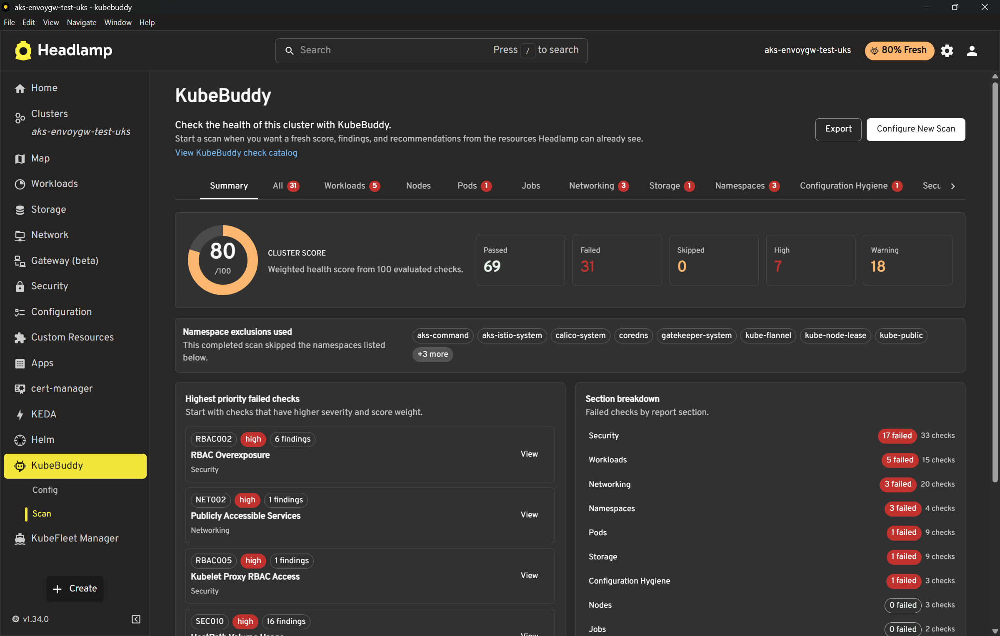

# KubeBuddy Headlamp Plugin

The KubeBuddy Headlamp plugin lets you run Kubernetes checks from inside Headlamp for the active cluster. It uses resource data already available to Headlamp and shows a score, summary, findings, recommendations, and export options without installing anything into the cluster.

The plugin is released with the main KubeBuddy release so the Headlamp checks stay aligned with the Kubernetes check catalog in the repo.

## Screenshot



## Versioning

The Headlamp plugin has its own plugin package version, but each published package states which KubeBuddy release/checks it includes.

Example:

```text
KubeBuddy release: v0.0.31
Headlamp plugin version: 0.1.0
Includes KubeBuddy checks from v0.0.31
```

This avoids implying that the new plugin has the same maturity as the CLI while still making it clear which KubeBuddy checks are included.

## Scope

The plugin currently supports browser-side Kubernetes checks only.

Included:

- Kubernetes workload, pod, node, networking, storage, namespace, configuration hygiene, security, RBAC, and event checks
- summary score and severity counts
- finding cards grouped by category
- namespace exclusions
- check and severity filters
- CSV findings export
- JSON report export
- `kubebuddy-config.yaml` import and export for supported browser-safe settings

Not included:

- AKS checks that require Azure API access
- GKE checks that require Google Cloud API access
- Prometheus checks
- PowerShell execution
- `kubectl` execution
- the native Go CLI engine

The plugin keeps scans explicit and local to the active Headlamp page. If the page is closed, refreshed, or navigated away during a scan, the browser-side scan stops.

## Install

From Headlamp Desktop:

1. Open Headlamp Desktop.
2. Go to Plugin Catalog.
3. Search for KubeBuddy.
4. Open the plugin details page and click Install.
5. Restart Headlamp if prompted.
6. Open KubeBuddy from the cluster sidebar.

With the Headlamp plugin CLI:

```bash
npx @kinvolk/headlamp-plugin install https://artifacthub.io/packages/headlamp/kubebuddy/kubebuddy-headlamp-plugin
```

For in-cluster Headlamp installs with the plugin manager:

```yaml
config:
  watchPlugins: true

pluginsManager:
  enabled: true
  configContent: |
    plugins:
      - name: kubebuddy-headlamp-plugin
        source: https://artifacthub.io/packages/headlamp/kubebuddy/kubebuddy-headlamp-plugin
        version: 0.1.0
    installOptions:
      parallel: true
      maxConcurrent: 2
```

## Running A Scan

Open KubeBuddy from the Headlamp cluster sidebar and choose the namespaces you want to exclude before starting the scan.

The scan uses Kubernetes resources Headlamp can already read through the current cluster connection. If the current user does not have permission to list a resource type, checks that depend on that data may be skipped or may produce incomplete results.

After a scan completes, the Summary tab shows:

- cluster score
- passed, failed, skipped, and severity counts
- namespace exclusions used
- top failed checks

The Findings tab shows grouped check cards. Cards are collapsed by default to keep large reports responsive. Expand a card to view recommendations and affected resources.

## Configuration

The Config page supports importing and exporting `kubebuddy-config.yaml` for settings that make sense in the browser plugin.

Supported settings include:

- namespace exclusions
- excluded checks
- trusted registries
- allowed load balancer namespaces
- expected pod security profile
- threshold values used by supported checks

Importing YAML updates the structured controls on the page. Changes are not saved until you select Save Config.

CLI-only settings are preserved where possible during import/export, but they are not executed by the plugin.

## Exports

The scan page export menu supports:

- JSON report export for structured troubleshooting and automation
- CSV findings export for lightweight review and sharing

The Headlamp plugin does not export HTML reports because the plugin UI is already the interactive report surface. Use the native CLI when you need a standalone HTML report file.

## Resource Suppressions

The Headlamp plugin honors the same `kubebuddy.io/ignore-checks` resource annotations as the CLI. Suppressed findings are excluded from active finding counts and score calculations, and exported JSON keeps them separately as suppression metadata.

For Pod findings created by workload controllers, add the annotation to `spec.template.metadata.annotations` so Kubernetes copies it to created Pods.

## Release Notes

The plugin package is attached to the same GitHub release as the native KubeBuddy CLI artifacts. Artifact Hub metadata records the plugin version and the KubeBuddy checks version included in the package.

For release automation details, see the [Release Process](../development/release-process.md).
