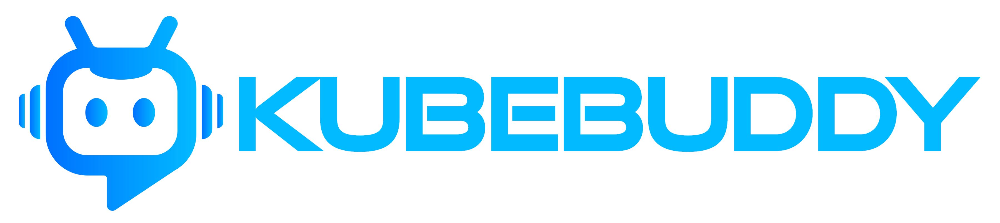

# 🌀 KubeBuddy powered by KubeDeck – Kubernetes Monitoring & Reporting

## **PowerShell-Based Kubernetes Insights for Cluster Health & Security**

Welcome to **KubeBuddy powered by KubeDeck** – the **PowerShell-powered** tool that helps you monitor, analyze, and report on your Kubernetes environments with ease.

Whether you're an administrator managing production clusters or a developer troubleshooting workloads, **KubeBuddy powered by KubeDeck** simplifies Kubernetes monitoring with automated health checks, security insights, and structured reporting.

## ✨ Key Features

✅ **Cluster Health Monitoring** – Check node status, resource utilization, and pod conditions.  
✅ **Workload Analysis** – Detect failing pods, restart loops, and job issues.  
✅ **Event Reporting** – Summarize Kubernetes events to surface errors and warnings.  
✅ **RBAC & Security Checks** – Identify excessive permissions and security misconfigurations.  
✅ **Storage & Networking Insights** – Analyze persistent volumes, services, and network policies.  
✅ **Customizable Thresholds** – Set warning/critical levels in `kubebuddy-config.yaml`.  
✅ **HTML & Text Reports** – Generate clean, shareable reports.  
✅ **Azure AKS Health Check** – Monitor AKS clusters with PowerShell commands.  

## 🚀 Get Started

📌 **[Installation Guide](docs/installation)** – Step-by-step setup instructions.  
📌 **[Usage Documentation](docs/usage)** – Learn how to use KubeBuddy powered by KubeDeck effectively.  
📌 **[GitHub Repository](https://github.com/KubeDeckio/KubeBuddy)** – Contribute and follow the latest updates.  

---

💡 **Monitor and analyze your Kubernetes clusters effortlessly with KubeBuddy powered by KubeDeck – Built with PowerShell!**

