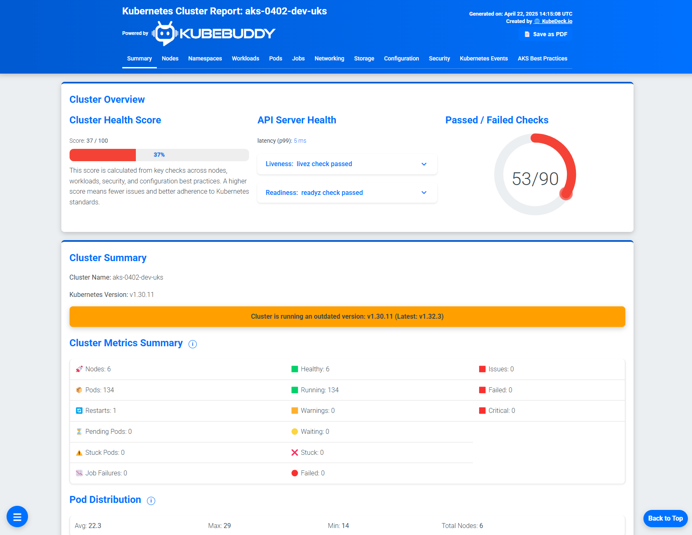
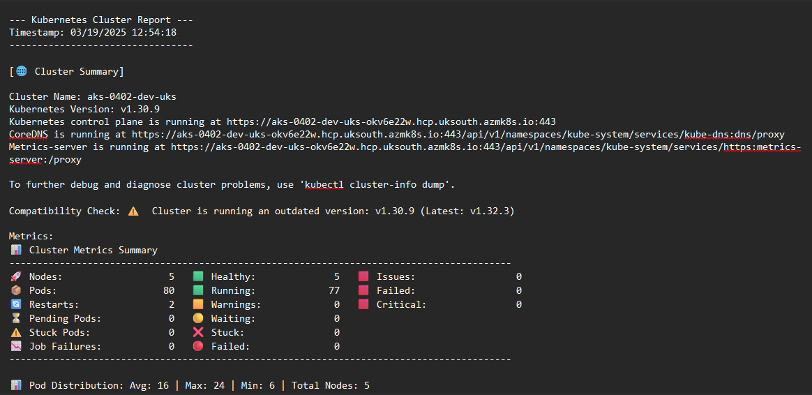
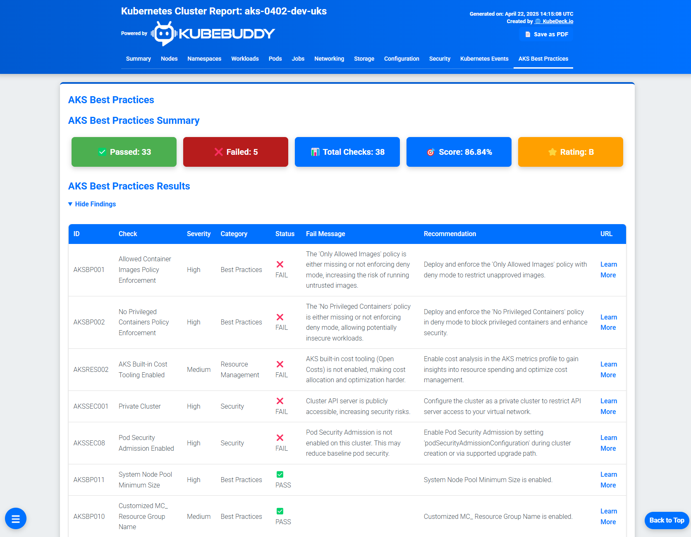
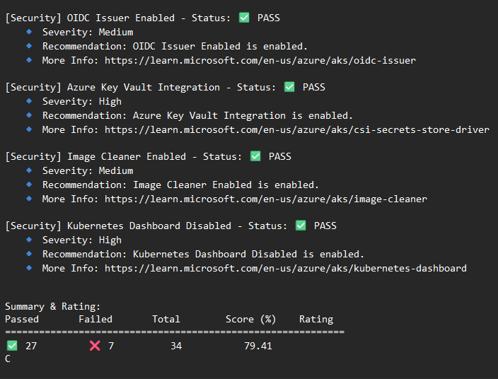

# PowerShell Usage

If you're using **KubeBuddy powered by KubeDeck** via PowerShell, this guide will help you monitor and analyze your Kubernetes clusters. Below are detailed instructions and examples for various commands.

## 🔧 Prerequisites

Before running KubeBuddy powered by KubeDeck, ensure you:
- Are **connected to a Kubernetes cluster/context**.
- Have **kubectl** installed and configured.
- Have **Azure CLI (az cli)** installed if using AKS features.
- Are **logged into Azure** and using the correct subscription for AKS monitoring.

## 🔗 Related Guide

If you're running AKS checks or using the `-Aks` flag, see the full [AKS Configuration & Best Practices Setup](aks-best-practice-checks.md) guide for prerequisites and role setup.


## Available Commands

The following table provides a quick reference for KubeBuddy powered by KubeDeck commands:

| Action | Command Example |
|---------------------------|----------------|
| Run KubeBuddy powered by KubeDeck | `Invoke-KubeBuddy` |
| Generate an HTML report | `Invoke-KubeBuddy -HtmlReport` |
| Generate an JSON report | `Invoke-KubeBuddy -jsonReport` |
| Generate a text report | `Invoke-KubeBuddy -txtReport` |
| Generate reports with custom path | `Invoke-KubeBuddy -HtmlReport -OutputPath ./custom-report` |
| Run a KubeBuddy powered by KubeDeck with an AKS Best Practices Check | `Invoke-KubeBuddy -Aks -SubscriptionId <subscriptionID> -ResourceGroup <resourceGroup> -ClusterName <clusterName>` |
| Run AKS best practices check and HTML report | `Invoke-KubeBuddy -HtmlReport -Aks -SubscriptionId $SubscriptionId -ResourceGroup $ResourceGroup -ClusterName $ClusterName` |
| Run AKS best practices check and text report | `Invoke-KubeBuddy -txtReport -Aks -SubscriptionId $SubscriptionId -ResourceGroup $ResourceGroup -ClusterName $ClusterName` |

## 1. Running KubeBuddy powered by KubeDeck

To run KubeBuddy powered by KubeDeck on your Kubernetes cluster:

```powershell
Invoke-KubeBuddy
```

This command provides a detailed menu-driven interface that allows you to navigate through various monitoring options. It analyzes node status, resource usage, workloads, and RBAC security settings.

## 2. Running KubeBuddy powered by KubeDeck with an AKS Best Practices Check

To check best practices for an **Azure Kubernetes Service (AKS)** cluster:

```powershell
Invoke-KubeBuddy -Aks -SubscriptionId <subscriptionID> -ResourceGroup <resourceGroup> -ClusterName <clusterName>
```

You **must** provide your Azure Subscription ID, the **Resource Group** where your AKS cluster resides, and the **Cluster Name**.

## 3. Generating Reports

### **Generate an HTML Report**
```powershell
Invoke-KubeBuddy -HtmlReport
```


<a href="https://raw.githubusercontent.com/KubeDeckio/KubeBuddy/refs/heads/main/docs/examples/html-report-sample.html" target="_blank" rel="noopener noreferrer">View Sample HTML Report</a>

---
### **Generate a JSON Report**
```powershell
Invoke-KubeBuddy -jsonReport
```
---

### **Generate a Text Report**
```powershell
Invoke-KubeBuddy -txtReport
```


<a href="https://raw.githubusercontent.com/KubeDeckio/KubeBuddy/refs/heads/main/docs/examples/text-report-sample.txt" target="_blank" rel="noopener noreferrer">View Sample txt Report</a>

---

### **Customizing Report Output Path**
You can specify a **custom filename or directory** for the report using `-OutputPath`.

#### **Save report in a specific directory**
```powershell
Invoke-KubeBuddy -HtmlReport -OutputPath ./reports
```
✔️ Saves the **HTML** report as:
```
./reports/kubebuddy-report-YYYYMMDD-HHMMSS.html
```

```powershell
Invoke-KubeBuddy -jsonReport -OutputPath ./reports
```
✔️ Saves the **JSON** report as:
```
./reports/kubebuddy-report-YYYYMMDD-HHMMSS.json
```

```powershell
Invoke-KubeBuddy -txtReport -OutputPath ./reports
```
✔️ Saves the **TXT** report as:
```
./reports/kubebuddy-report-YYYYMMDD-HHMMSS.txt
```

---

#### **Generate report with a custom filename**
```powershell
Invoke-KubeBuddy -HtmlReport -OutputPath ./custom-report.html
```
✔️ Saves the **HTML** report as:
```
./custom-report.html
```

```powershell
Invoke-KubeBuddy -jsonReport -OutputPath ./custom-report.json
```
✔️ Saves the **JSON** report as:
```
./custom-report.json
```

```powershell
Invoke-KubeBuddy -txtReport -OutputPath ./custom-report.txt
```
✔️ Saves the **TXT** report as:
```
./custom-report.txt
```


## 4. Running an AKS Health Check alongside the HTML report

To check best practices for an Azure Kubernetes Service (AKS) cluster, ensure you are logged into Azure and using the correct subscription:

```powershell
az login
az account set --subscription <subscription-id>
Invoke-KubeBuddy -HtmlReport -Aks -SubscriptionId $SubscriptionId -ResourceGroup $ResourceGroup -ClusterName $ClusterName
```


<a href="https://raw.githubusercontent.com/KubeDeckio/KubeBuddy/refs/heads/main/docs/examples/html-report-sample.html" target="_blank" rel="noopener noreferrer">View Sample HTML Report</a>
---

## 5. Running an AKS Health Check alongside the JSON report

To check best practices for an Azure Kubernetes Service (AKS) cluster:

```powershell
az login
az account set --subscription <subscription-id>
Invoke-KubeBuddy -jsonReport -Aks -SubscriptionId $SubscriptionId -ResourceGroup $ResourceGroup -ClusterName $ClusterName
```

---

## 5. Running an AKS Health Check alongside the txt report

To check best practices for an Azure Kubernetes Service (AKS) cluster:

```powershell
az login
az account set --subscription <subscription-id>
Invoke-KubeBuddy -txtReport -Aks -SubscriptionId $SubscriptionId -ResourceGroup $ResourceGroup -ClusterName $ClusterName
```


<a href="https://raw.githubusercontent.com/KubeDeckio/KubeBuddy/refs/heads/main/docs/examples/text-report-sample.txt" target="_blank" rel="noopener noreferrer">View Sample text Report</a>

---

## 6. Additional Parameters

| Parameter                 | Type      | Default                              | Description                                                                                  |
|---------------------------|----------|--------------------------------------|----------------------------------------------------------------------------------------------|
| `-OutputPath`            | String   | `$HOME/kubebuddy-report`             | Folder or file name where report files are saved. Supports custom filenames.                 |
| `-Aks`                   | Switch   | (N/A)                                | Runs AKS best practices checks. Requires `-SubscriptionId`, `-ResourceGroup`, `-ClusterName`. |
| `-SubscriptionId`        | String   | (None)                               | Azure subscription ID (used with `-Aks`).                                                    |
| `-ResourceGroup`         | String   | (None)                               | Azure resource group (used with `-Aks`).                                                     |
| `-ClusterName`           | String   | (None)                               | AKS cluster name (used with `-Aks`).                                                         |
| `-HtmlReport`            | Switch   | (N/A)                                | Generates an HTML report in `-OutputPath`.                                                   |
| `-JsonReport`            | Switch   | (N/A)                                | Generates a JSON report in `-OutputPath`.                                                    |
| `-txtReport`             | Switch   | (N/A)                                | Generates a text report in `-OutputPath`.                                                   |
